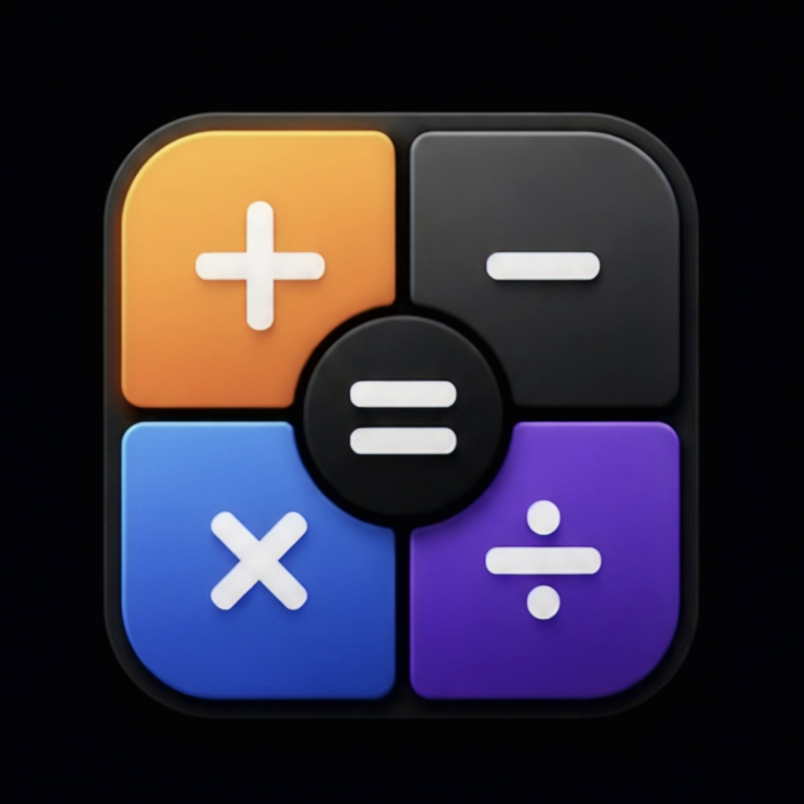

<div align="center">



# MathX

**A full-featured, secure scientific calculator and currency & unit converter for Android — 160+ live currencies, 8 unit categories, and a complete scientific keypad, with zero dependencies on unsafe expression engines.**

[](https://github.com/vincenzo-afk/CALCULATOR)
[](https://developer.android.com/guide/topics/manifest/uses-sdk-element)
[](https://kotlinlang.org)
[](https://gradle.org)
[](https://github.com/vincenzo-afk/CALCULATOR/releases)
[](https://github.com/vincenzo-afk/CALCULATOR/actions)
[](#license)

[⭐ Star the repo](https://github.com/vincenzo-afk/CALCULATOR/stargazers) · [🐛 Report a bug](https://github.com/vincenzo-afk/CALCULATOR/issues) · [💡 Request a feature](https://github.com/vincenzo-afk/CALCULATOR/issues)

</div>

---

## Table of Contents

1. [About the Project](#about-the-project)
2. [Key Features](#key-features)
3. [Security First](#security-first)
4. [Tech Stack](#tech-stack)
5. [Getting Started](#getting-started)
6. [Usage Guide](#usage-guide)
7. [Architecture](#architecture)
8. [Project Structure](#project-structure)
9. [Testing](#testing)
10. [Build & Install](#build--install)
11. [Roadmap](#roadmap)
12. [Contributing](#contributing)
13. [Security Policy](#security-policy)
14. [License](#license)
15. [Acknowledgments](#acknowledgments)

---

## About the Project

MathX is an Android calculator app that started life as a small hobby project — and was rebuilt from the ground up into a production-quality application. The original codebase contained a **critical security vulnerability**: it passed user input directly into a JavaScript engine (`eval()`), which allowed arbitrary Java code execution on the device, alongside stale hardcoded exchange rates, a missing keypad, and silently wrong answers (`1/0` displayed as "Infinity", `0.1+0.2` displayed with floating-point noise).

The rewritten MathX replaces the unsafe engine with a **safe recursive-descent math parser**, adds a complete calculator keypad with every standard symbol, real-time currency conversion for **160+ currencies** from the European Central Bank reference rates, seven unit-conversion categories, and a dark, modern UI. Every arithmetic path is verified by an automated test suite that simulates real button presses and checks the exact displayed answer.

### Key Features

- 🔢 **Standard keypad** — digits, decimal, AC, DEL, ±, + − × ÷, %, parentheses, and equals, styled in a dark theme inspired by modern calculator apps.
- 🔬 **Scientific mode (FX)** — trigonometry (sin/cos/tan + inverses), hyperbolic functions, x², x³, xʸ, 10ˣ, eˣ, 1/x, √, ∛, lg (log₁₀), ln, x!, π, e, implicit multiplication, and a DEG/RAD angle toggle.
- 💱 **Live currency conversion** — 160+ currencies with real-time rates from the [European Central Bank](https://www.ecb.europa.eu/stats/policy_and_exchange_rates/euro_reference_exchange_rates/html/index.en.html) via the Frankfurter API, cached offline with fallback rates.
- 📏 **Unit converter** — length, weight, volume, area, data (KB/MB/GB and KiB/MiB/GiB), time, and temperature (°C/°F/K) with correct non-linear formulas.
- 🧮 **Smart expression handling** — automatic closing of open parentheses, correct operator precedence, floating-point noise suppression (0.1+0.2 = 0.3).
- 🕐 **Persistent history** — calculations grouped by date with one-tap clear.
- 💾 **Memory keys** — M+, M−, MR, MC, plus Ans (last answer) chaining.
- 🚫 **Error-proof math** — division by zero, negative square roots, and invalid syntax all produce clear errors instead of silent wrong answers.

## Security First

MathX was built around one hard requirement: **user input must never be executed as code**. The previous `eval()`-based engine was replaced by a hand-written recursive-descent parser that understands only numbers, operators, constants, and a whitelisted set of math functions. Injection payloads such as `java.lang.Runtime.getRuntime().exec(...)` are rejected at the tokenizer stage with a syntax error.

| Threat | Old app behavior | MathX behavior |
|---|---|---|
| Code injection via expression | Arbitrary Java execution | Tokenizer rejects all non-math input |
| Division by zero | Displays "Infinity" | Shows a clear `Error` |
| Negative square root | Undefined / crash-prone | Domain error with `Error` display |
| Floating-point noise | `0.1+0.2 = 0.30000000000000004` | Rounded display `0.3` |

## Tech Stack

| Layer | Technology |
|---|---|
| Language | Kotlin 2.1 (JVM target 17) |
| Build system | Gradle 8+ with Kotlin DSL |
| Android | compileSdk 36, targetSdk 36, minSdk 24 (Android 7.0+) |
| UI | Android Views + XML layouts, Material 3 theming |
| Networking | `java.net.HttpURLConnection` (no third-party network libraries) |
| Expression evaluation | Custom recursive-descent parser (safe by design) |
| Currency data | Frankfurter API (ECB reference rates) |
| Testing | JUnit 4 unit tests |
| CI build verification | Local Gradle builds (APK + test suite) |

## Getting Started

### Prerequisites

| Tool | Minimum version |
|---|---|
| Android Studio Hedgehog (2023.1.1) or newer | Recommended |
| JDK | 17 |
| Android SDK | Platform 36, Build-Tools 35+ |

No API keys or third-party accounts are required — currency rates are fetched from a free public endpoint.

### Installation (from source)

```bash
# 1. Clone the repository
git clone https://github.com/vincenzo-afk/CALCULATOR.git
cd CALCULATOR

# 2. Build the debug APK
./gradlew assembleDebug

# 3. Install on a connected device or emulator
adb install -r app/build/outputs/apk/debug/app-debug.apk
```

The prebuilt APK is also attached to the [latest release](https://github.com/vincenzo-afk/CALCULATOR/releases).

### Configuration

MathX works out of the box with zero configuration. The currency module refreshes rates daily and caches the last successful fetch in `SharedPreferences`, so it continues to work offline.

| Setting | Location | Description |
|---|---|---|
| Default currencies | Converter panel → tap a currency row | Swap between any of the 160+ supported currencies |
| Angle mode | Mode row → DEG/RAD | Toggles trigonometry between degrees and radians |
| History | Mode row → HIST | View or clear persisted calculation history |

## Usage Guide

### Basic calculations

Type the expression on the keypad and press `=`. Parentheses are available on the bottom row, so grouping works naturally: `(2+3)*4 = 20`. The `%` key converts the number to its decimal fraction: `500% = 5`, `500+10% = 550`.

### Scientific functions

Tap **FX** in the mode row to switch to the 8-column scientific keypad. Press `sin` then `30` then `=` to get `0.5` (DEG mode). The **2ⁿᵈ** key toggles inverse functions (sin→asin), cube/root, and alternate log/exp labels. Press `1/x` after any expression to instantly replace the display with its reciprocal.

### Currency conversion

Tap **$** in the mode row, choose the source and target currencies (e.g., USD → INR), and type the amount on the converter keypad. Conversion happens live as you type. Rates are fetched from the European Central Bank reference feed and stamped with the last-update date.

### Unit conversion

In the **$** mode, use the category chips to switch between Currency, Length, Weight, Volume, Area, Data, Time, and Temperature. Select units from the two dropdowns and type the value — the result updates live. Temperature uses correct non-linear formulas (e.g., 0 °C = 32 °F = 273.15 K).

### Memory and history

`M+` / `M−` add to or subtract from memory, `MR` recalls it into the expression, and `MC` clears it. The last answer is available via the history panel, which is persisted between app restarts.

## Architecture

MathX follows a clean three-layer structure with no architectural frameworks, keeping the module count minimal and the app easy to audit.

```
┌──────────────────────────────────────────────┐
│  UI Layer (MainActivity + XML layouts)       │
│  - Keypad dispatch, display formatting       │
├──────────────────────────────────────────────┤
│  Domain Layer                                │
│  - ExpressionEvaluator (safe recursive-      │
│    descent parser: tokenize → parse → eval)  │
│  - UnitConverter (category factors + temp    │
│    formulas)                                 │
├──────────────────────────────────────────────┤
│  Data Layer                                  │
│  - CurrencyRepository (HTTP fetch, JSON      │
│    parse, SharedPreferences cache)           │
└──────────────────────────────────────────────┘
```

The expression pipeline tokenizes the normalized input (unicode operators ×÷−π are mapped to ASCII), parses it with a precedence-correct grammar (postfix > power > term > expression), and formats the result to ten significant digits with trailing-zero suppression.

## Project Structure

```
CALCULATOR/
├── app/
│   ├── build.gradle.kts          # Module config (SDK versions, JVM target)
│   └── src/
│       ├── main/java/com/example/advancedcalculator/
│       │   ├── MainActivity.kt       # UI controller, keypad & mode logic
│       │   ├── ExpressionEvaluator.kt # Safe math parser (core engine)
│       │   ├── CurrencyRepository.kt  # Live FX rates + cache
│       │   ├── UnitConverter.kt       # Unit conversion math
│       │   └── ui/theme/              # Material 3 theme
│       ├── main/res/
│       │   ├── layout/                # activity_main.xml (all panels)
│       │   ├── mipmap-*/              # MathX launcher icons
│       │   └── drawable/              # Key button styles
│       └── test/java/.../
│           ├── CalculatorLogicTest.kt  # 19 parser/engine tests
│           ├── UnitConverterTest.kt    # 10 converter tests
│           └── ExhaustiveButtonTest.kt # 15 full button-path tests
├── assets/mathx_logo.png           # Master logo
├── gradlew / gradlew.bat           # Gradle wrapper
└── settings.gradle.kts
```

## Testing

MathX ships with **44 passing unit tests**, including an exhaustive harness that simulates the exact `onButtonClick` pipeline: each test presses real keypad tokens, assembles the expression exactly as the UI does, evaluates it, and asserts the displayed answer.

```bash
# Run the full test suite
./gradlew testDebugUnitTest
```

Verified answers include: `54−36 = 18`, the 44-term chained sum `= 112,968`, `sin(30°) = 0.5`, `sin(90°) = 1`, `cos(90°) = 0`, `tan(45°) = 1`, `2+3×4 = 14`, `(2+3)×4 = 20`, `sqrt(144) = 12`, `5! = 120`, `10^3 = 1000`, `lg(100) = 2`, `1/0 = Error`, and reciprocal `1/5 = 0.2`.

## Build & Install

| Task | Command |
|---|---|
| Run tests | `./gradlew testDebugUnitTest` |
| Build debug APK | `./gradlew assembleDebug` |
| Build release APK | `./gradlew assembleRelease` |
| Install on device | `adb install -r app/build/outputs/apk/debug/app-debug.apk` |

## Roadmap

- [x] Safe expression engine (no `eval`)
- [x] Full standard + scientific keypad
- [x] Live currency conversion (160+ currencies)
- [x] Unit converter (8 categories)
- [x] History with date grouping
- [x] Dark theme matching modern calculator UIs
- [ ] Graphing mode
- [ ] History search and re-calculation from a past entry
- [ ] Widget for home-screen quick calculations

## Contributing

Contributions are welcome. Please open an issue first to discuss substantial changes, then fork the repository, create a branch (`feature/description`), and submit a pull request with passing tests.

```bash
git checkout -b feature/your-feature
# ... make changes ...
./gradlew testDebugUnitTest   # all 44 tests must pass
git commit -m "feat: description"
git push origin feature/your-feature
```

## Security Policy

MathX is designed to be safe against the exact class of vulnerability that existed in the original app. If you discover a way to make the evaluator execute non-math input, or any other vulnerability, please report it by opening an issue at [github.com/vincenzo-afk/CALCULATOR/issues](https://github.com/vincenzo-afk/CALCULATOR/issues) and it will be triaged promptly.

## License

This project is licensed under the [MIT License](https://opensource.org/licenses/MIT) — see the [LICENSE](LICENSE) file for details.

## Acknowledgments

- Exchange rates courtesy of the [European Central Bank](https://www.ecb.europa.eu) via the [Frankfurter API](https://frankfurter.dev)
- UI inspiration: modern dark-theme calculator apps (xCurrency-style keypad)
- Logo: custom MathX branding

<div align="center">

**Built with ❤️ by [vincenzo-afk](https://github.com/vincenzo-afk)**

[⬆ Back to top](#mathx)

</div>
